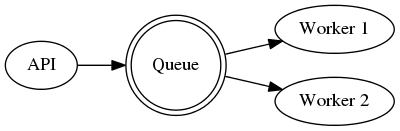

-- *Slide* --

## In the beginning

### The monolith

<a title="CATHERINE PRIOR [CC BY-SA 2.0 (http://creativecommons.org/licenses/by-sa/2.0)], via Wikimedia Commons" 
href="https://commons.wikimedia.org/wiki/File%3ASt_Breock_Down_Monolith_-_Standing_Stone_-_geograph.org.uk_-_109844.jpg">

</a>

-- *Slide End* --

-- *Slide* --

## Which decomposed

### Horizontally and vertically

<a title="By Bernard Gagnon (Own work) [GFDL (http://www.gnu.org/copyleft/fdl.html) or CC BY-SA 3.0 (http://creativecommons.org/licenses/by-sa/3.0)], via Wikimedia Commons" 
href="https://commons.wikimedia.org/wiki/File%3AStonehenge_02.jpg">
</a>

-- *Slide End* --

-- *Slide* --

## Then came the cloud

### Unconstrained supply

<a title="By Joydeep (Own work) [CC BY-SA 3.0 (http://creativecommons.org/licenses/by-sa/3.0)], via Wikimedia Commons" 
href="https://commons.wikimedia.org/wiki/File%3ACumulus_cloud_before_rain.jpg">
</a>

-- *Slide End* --

-- *Slide* --

## There was a period of Instability

### While we learned

<a title="By Nevit Dilmen (Own work) [GFDL (http://www.gnu.org/copyleft/fdl.html) or CC-BY-SA-3.0 (http://creativecommons.org/licenses/by-sa/3.0/)], via Wikimedia Commons" 
href="https://commons.wikimedia.org/wiki/File%3AUnstable_walk.jpg">
</a>

-- *Slide End* --

-- *Slide* --

## But convergence came

### With 'microservices'

<a href="https://commons.wikimedia.org/wiki/File:Cairn_at_Garvera,_Surselva,_Graubuenden,_Switzerland.jpg#/media/File:Cairn_at_Garvera,_Surselva,_Graubuenden,_Switzerland.jpg">
</a>

-- *Slide End* --

-- *Slide* --

## A microservice

The entire team can be fed by two large Pizza's

-- *Slide End* --

-- *Slide* --

## Microservice goodness

* Scaling
* Modularity
* Change the parts independently
* Allow mix of technologies
* Ease development (can add developers!)
* Fault tolerant

-- *Slide End* --

-- *Slide* --

## Microservice badness

* Increased complexity
* More support
* Application speed
* Decentralized data
* Lock you into integration choices (refactoring)
* More points of failure

-- *Slide End* --

-- *Slide* --

## A sample application!

### First App Application For OpenStack (faafo)

https://github.com/stackforge/faafo

A handy dandy fractal generator

-- *Slide End* --

-- *Slide* --

## They even wrote a book!

### Writing your first OpenStack application

http://developer.openstack.org/firstapp-libcloud/

### PS: a work in progress...

-- *Slide End* --

-- *Slide* --

## To explore it we need to run it...

So use your checklists to launch the VM!

* <span style="color:red">&#9632;</style> = help me!
* <span style="color:green">&#9632;</style> = I'm ready to move on...

-- *Slide End* --

-- *Slide* --

## All that was done your instance

```bash
sudo -i
apt-get update
apt-get upgrade
apt-get install python-pip
pip install apache-libcloud
apt-get install git
git clone https://github.com/MartinPaulo/faafo_infrastructure.git
```
-- *Slide End* --

## `ssh` into your instance

```bash
ssh -i <key> ubuntu@<IP>
```

* <span style="color:red">&#9632;</style> = help me!
* <span style="color:green">&#9632;</style> = I'm ready to move on...

-- *Slide* --

## Set up your configs...

```bash
sudo -i
cp faafo.cfg.template faafo.cfg
nano faafo.cfg
```

* <span style="color:red">&#9632;</style> = help me!
* <span style="color:green">&#9632;</style> = I'm ready to move on...

-- *Slide End* --

-- *Slide* --

## Use your initials!

```python
[Names]
# chapter 1
all-in-one = mp_all_in_one
# chapter 2
app_controller_name = mp_ac
app_worker_name = mp_wn
# chapter 3
app-services = mp_as
app-api-1 = mp_aa1
app-api-2 = mp_aa2
worker-1 = mp_w1
worker-2 = mp_w2
worker-3 = mp_w3
```

* <span style="color:red">&#9632;</style> = help me!
* <span style="color:green">&#9632;</style> = I'm ready to move on...


-- *Slide End* --

-- *Slide* --

## Unleash the monolith!

```bash
python chapter1.py 
```

* <span style="color:red">&#9632;</style> = help me!
* <span style="color:green">&#9632;</style> = I'm ready to move on...

-- *Slide End* --

-- *Slide* --

## A walk through the launch code...

```bash
nano chapter1.py
```

-- *Slide End* --

-- *Slide* --

## Let's play with faafo

Connect to the server....

```bash
ssh -i <key> ubuntu@<IP>
```

PS: From your local machine!

* <span style="color:red">&#9632;</style> = help me!
* <span style="color:green">&#9632;</style> = I'm ready to move on...

-- *Slide End* --

-- *Slide* --

## faafo cheat sheet...

```bash
faafo create
faafo create --height 9999 --width 9999 --tasks 5
faafo get --help
faafo list --help
faafo delete --help

for i in $(seq 1 5); do faafo create; done
```

-- *Slide End* --

-- *Slide* --

# The magic!

### FAAFO architecture


-- *Slide End* --

-- *Slide* --

# The Queue



-- *Slide End* --

-- *Slide* --

# And now...

A walk through faafo's code...

https://github.com/stackforge/faafo

-- *Slide End* --

-- *Slide* --

# Scale it up one level

```bash
python teardown.py 
python chapter2.py 
```

* <span style="color:red">&#9632;</style> = help me!
* <span style="color:green">&#9632;</style> = I'm ready to move on...

-- *Slide End* --

-- *Slide* --

## A walk through the launch code...

```bash
nano chapter2.py
```

-- *Slide End* --

-- *Slide* --

## Let's play with faafo

To see the difference.

From your local machine!

```bash
ssh -i <key> ubuntu@<IP>
```

* <span style="color:red">&#9632;</style> = help me!
* <span style="color:green">&#9632;</style> = I'm ready to move on...

-- *Slide End* --

-- *Slide* --

# Much more faafo

```bash
python teardown.py 
python chapter3.py 
```

* <span style="color:red">&#9632;</style> = help me!
* <span style="color:green">&#9632;</style> = I'm ready to move on...

-- *Slide End* --

-- *Slide* --

## A walk through the launch code...

```bash
nano chapter3.py
```

-- *Slide End* --

-- *Slide* --

## Let's play with faafo

To see the difference.

From your local machine!

```bash
ssh -i <key> ubuntu@<IP>
```

* <span style="color:red">&#9632;</style> = help me!
* <span style="color:green">&#9632;</style> = I'm ready to move on...

-- *Slide End* --

-- *Slide* --

## Tear it all down

```bash
python teardown.py
```

* <span style="color:red">&#9632;</style> = help me!
* <span style="color:green">&#9632;</style> = I'm ready to move on...

-- *Slide End* --

-- *Slide* --

## A walk through the teardown code...

```bash
nano teardown.py
```

-- *Slide End* --

-- *Slide* --

## The path to enlightenment

* Build the simplest thing that can work (a monolith)
* Make sure it's got well defined internal boundaries
  ([package by feature rather than by layer](http://www.javapractices.com/topic/TopicAction.do?Id=205))
* When confident you are on the right path, turn it into a neomonolith...
* The start to split out the microservices as you grow

-- *Slide End* --
